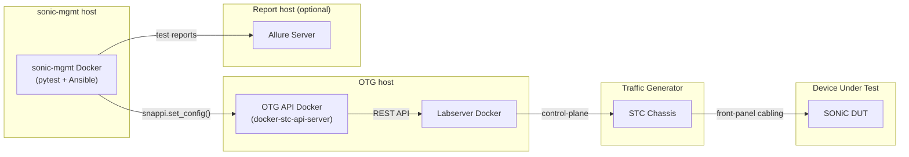

# Snappi Environment Setup and Quick Test Guide with VIAVI TestCenter (STC) and OTG

Quick start guide for deploying a Snappi test environment and running the pretest and Snappi smoke test against a SONiC DUT, using a VIAVI **TestCenter (STC)** chassis as the traffic generator, connected through the **OTG (Open Traffic Generator) API service**.

---

## 🚀 Recommended: Automated Setup (Start Here)

**Most users should start here.** The `container/run_snappi_test.sh` script
automates the entire workflow in one command, driven by a single `config.yaml`
file:

- Environment provisioning
- Testbed configuration
- Minigraph deployment
- Pretest execution
- Snappi smoke test execution

To use it, fill in your environment details in `config.yaml` (VIAVI image paths,
DUT info, license server, etc.) and run the script. This is the fastest way to
get a working environment and is the recommended path for first-time and routine
deployments.

For the full usage details, script options, and `config.yaml` field
reference, see [`container/README.md`](container/README.md).

**Use the detailed guide below instead if you need to:**
- Understand what each step is actually doing
- Customize the environment beyond what `config.yaml` exposes
- Troubleshoot a failure that occurred during the automated run
- Deploy manually on hardware/topologies the script doesn't yet cover

---

## 📖 Detailed Manual Setup & Reference Guide

The sections below walk through the complete manual deployment and test
workflow step by step, and double as the reference material for troubleshooting
the automated flow above.

- [1. Environment Overview](#1-environment-overview)
- [2. Prepare: Obtain VIAVI Software](#2-prepare-obtain-viavi-software)
- [3. Deploy the Test Environment](#3-deploy-the-test-environment)
  - [3.1 Get the sonic-mgmt repository](#31-get-the-sonic-mgmt-repository)
  - [3.2 Deploy the sonic-mgmt Docker container](#32-deploy-the-sonic-mgmt-docker-container)
  - [3.3 Deploy TestCenter (STC) and the virtual DUT (sonic-vs) with containerlab](#33-deploy-testcenter-stc-and-the-virtual-dut-sonic-vs-with-containerlab)
  - [3.4 Deploy the Labserver](#34-deploy-the-labserver)
  - [3.5 Deploy the OTG Service](#35-deploy-the-otg-service)
  - [3.6 (Optional) Deploy the Allure report server](#36-optional-deploy-the-allure-report-server)
- [4. Configure the Snappi Testbed](#4-configure-the-snappi-testbed)
  - [4.1 Device inventory — `sonic_snappi-sonic_devices.csv`](#41-device-inventory--sonic_snappi-sonic_devicescsv)
  - [4.2 Link mapping — `sonic_snappi-sonic_links.csv`](#42-link-mapping--sonic_snappi-sonic_linkscsv)
  - [4.3 Ansible inventory — `snappi-sonic`](#43-ansible-inventory--snappi-sonic)
  - [4.4 Testbed definition — `testbed.yaml`](#44-testbed-definition--testbedyaml)
  - [4.5 Topology definition — `vars/topo_<name>.yml`](#45-topology-definition--varstopo_nameyml)
  - [4.6 DUT credentials and group variables](#46-dut-credentials-and-group-variables)
  - [4.7 Verify the inventory loads correctly](#47-verify-the-inventory-loads-correctly)
  - [4.8 Apply the STC/OTG compatibility patch](#48-apply-the-stcotg-compatibility-patch)
- [5. Deploy the Minigraph to the DUT](#5-deploy-the-minigraph-to-the-dut)
- [6. Run the Pretest](#6-run-the-pretest)
- [7. Run the Snappi Smoke Test](#7-run-the-snappi-smoke-test)
- [8. Check the Test Reports](#8-check-the-test-reports)
- [9. Troubleshooting](#9-troubleshooting)
- [10. Command Cheat-Sheet](#10-command-cheat-sheet)

---

## 1. Environment Overview


*Figure 1 — control-plane and data-plane relationship between the sonic-mgmt Docker container, the OTG API service, the STC chassis, and the DUT.*

| Component | Role |
|---|---|
| **sonic-mgmt Docker** | Runs Ansible playbooks and the `pytest` test suite. Talks to the DUT over SSH and to the traffic generator through the `snappi` SDK. |
| **OTG API Docker** (`docker-stc-api-server`) | Translates `snappi` API calls into STC/Labserver REST calls. |
| **Labserver** | Manages STC chassis port reservation/resource allocation. |
| **STC Chassis** | The physical traffic generator; its front-panel ports are cabled directly to the DUT. |
| **Allure Server** *(optional)* | Collects and renders HTML test reports. |


**Deployment flexibility:** This entire environment can be stood up on a single Linux host — including a single WSL instance on Windows. The DUT side is equally flexible: point the testbed at a physical hardware DUT, or bring up a virtual DUT using the `sonic-vs` image (see §3.3).

---

## 2. Prepare: Obtain VIAVI Software

The TestCenter (STC) and Labserver Docker images, and the OTG setup package, are licensed VIAVI software — they are **not** publicly downloadable and are not part of the `sonic-mgmt` repository. **Contact VIAVI support** to obtain the following artifacts before starting §3:

| Artifact | Filename pattern | Used in |
|---|---|---|
| TestCenter (STC) chassis Docker image | `stc_<version>.tgz`, or a zip distribution `Spirent_TestCenter_Docker_<version>.zip` containing that same tgz | §3.3 — Deploy TestCenter (STC) and the virtual DUT (sonic-vs) with containerlab |
| Labserver Docker image | `labserver_<version>.tar.xz` | §3.4 — Deploy the Labserver; also loaded by the OTG Docker Compose deployment in §3.5 |
| OTG API service setup binary (standalone deployment) | `otgservice_<version>.sh` | §3.5 — Deploy the OTG Service |

Confirm the exact versions with VIAVI support for your lab — the STC chassis firmware, Labserver, and OTG service versions should be a combination VIAVI has validated together, since a mismatch between them is a common source of control-plane connection failures.


**License server (virtual DUT only):** deploying against the virtual `sonic-vs` DUT (§3.3) additionally requires a reachable TestCenter license — set as `SPIRENTD_LICENSE_FILE`/`LICENSE_SERVER` in §3.4/§3.5, format `@hostname` or `host:port` (a network license server, or a local Spirent license manager if you're using a hardware dongle). Contact [VIAVI support](https://www.viavisolutions.com/support) if you don't have one. Physical-DUT lab environments typically already have STC licensing provided by their existing test infrastructure.

**Notes:** Docker Engine 27.3.1 and Docker Compose 1.29.2 (or later) on the deployment Linux VM.

---

## 3. Deploy the Test Environment

### 3.1 Get the sonic-mgmt repository

```bash
git clone -b master --single-branch git@github.com:sonic-net/sonic-mgmt.git
cd sonic-mgmt
```

### 3.2 Deploy the sonic-mgmt Docker container

```bash
docker pull sonicdev-microsoft.azurecr.io:443/docker-sonic-mgmt:latest

# WSL only: run this once before the next command
sudo mount --make-rshared /

./setup-container.sh -n sonic-mgmt -i sonicdev-microsoft.azurecr.io:443/docker-sonic-mgmt:latest -d /data
```

`setup-container.sh` mounts the repository into the container at `/data/<repo-name>`, so test code and configuration survive even if the container itself is destroyed and recreated. In other words, the `sonic-mgmt` source checked out in §3.1 is bind-mounted into the running `sonic-mgmt` Docker container under the `/data` directory — refer to the separate deployment document for more details on the container's mount layout and setup options.

### 3.3 Deploy TestCenter (STC) and the virtual DUT (sonic-vs)

Skip this section when testing against real hardware.

For simplicity, the VIAVI TestCenter (STC) chassis container and the `sonic-vs` virtual DUT container are deployed together via [containerlab](https://containerlab.dev/), which brings up both nodes and wires the data-plane links between them in a single step. Skip the `sonic-vs` node when testing against real hardware — the STC container can still be deployed the same way, with its front-panel links cabled to a physical DUT instead.

**Load the TestCenter (STC) image:**
```bash
# Obtain the image from VIAVI support, e.g. stc_5.62.0766.tgz
docker load -i stc_5.62.0766.tgz
```

VIAVI may instead ship this as a zip distribution, e.g. `Spirent_TestCenter_Docker_5.62.0766.zip`, which contains that same `stc_5.62.0766.tgz`. If using `run_snappi_test.sh` (§1), just place either file under `images.dir` — the script auto-extracts the zip on first use and loads the tgz automatically. Loading manually as above, unzip it first:
```bash
unzip Spirent_TestCenter_Docker_5.62.0766.zip
docker load -i stc_5.62.0766.tgz
```

**Build the sonic-vs image** *(skip if testing against real hardware)*:

> **Automated:** if `dut.image`'s repository is exactly `vrnetlab/sonic_sonic-vs` (any tag - `master` or a release branch like `202511`) and it isn't already present in `docker images` (and no archive is configured/found under `images.dir`), `run_snappi_test.sh` does the steps below for you automatically, as long as `dut.build_sonic_vs` (default `true`) is not set to `false`. It always builds the exact tag `dut.image` asks for, never a different one (e.g. never fabricates `202511` from a `master` build). Where `sonic-vs.img.gz` is downloaded from is controlled by `dut.download_source` (default `auto`: try Azure Pipelines first, fall back to sonic.software if Azure has no successful build for that tag). Fails with a clear error if the selected source(s) have no published build for it. **None of this branch/tag lookup ever runs for an image already present in `docker images`** - including a custom/manually-built or manually-imported tag with no corresponding SONiC branch name, which is always used as-is. See `dut.build_sonic_vs` / `dut.download_source` in [config.yaml](config.yaml) / [§6](README.md#6-configyaml-reference).

1. Download `sonic-vs.img.gz` for the desired branch. `dut.download_source` picks which of these the automation above uses (`auto` tries the first and falls back to the second):
   - **Azure Pipelines** (`sonic-build.azurewebsites.net`, pipeline 142 - the default source):
     1. Open https://sonic-build.azurewebsites.net/ui/sonic/Pipelines and scroll all the way to the bottom, where the `vs` platform is listed.
     2. Pick the branch/tag you want to use (e.g. `master`) and click its "Build History".
     3. On the build history page, choose the latest build with `Result` = `succeeded` and click its "Artifacts" link.
     4. In the new window there's a single artifact listed (`sonic-buildimage.vs`) - click it.
     5. Scroll all the way down (or Ctrl+F) until you see `target/sonic-vs.img.gz`, then click it to start the download or copy the download link.
     (Equivalent direct URL for a given branch: https://sonic-build.azurewebsites.net/ui/sonic/pipelines/142/builds?branchName=master)
   - **sonic.software** (https://sonic.software/, pick a branch, e.g. `master`) - the page itself is JS-rendered, but it's populated from the static `https://sonic.software/builds.json` (e.g. `.master["sonic-vs.img.gz"].url`), which is what the automation above parses directly when using this source.
2. Build the container image following [vrnetlab's sonic-vs guide](https://github.com/srl-labs/vrnetlab/blob/master/sonic/README.md):
   ```bash
   gunzip sonic-vs-<version>.img.gz
   mv sonic-vs-<version>.img sonic-vs-<version>.qcow2
   cp sonic-vs-<version>.qcow2 vrnetlab/sonic/
   cd vrnetlab/sonic
   make
   ```
   This produces the `vrnetlab/sonic_sonic-vs:<version>` image referenced by the topology below.

**Define the topology** in `snappi-sonic-stc-clab.yml`:

Use STC version 5.62.0766 as an example:
```yaml
name: snappi-sonic-stc

mgmt:
  network: clab-snappi-sonic
  ipv4-subnet: 192.168.1.0/24

topology:
  defaults:
    env:
      CLAB_MGMT_PASSTHROUGH: "true"

  nodes:
    snappi-sonic-stc:
      kind: linux
      image: stc:5.62.0766
      mgmt-ipv4: 192.168.1.2

    sonic-s6100-dut1:
      kind: sonic-vm
      image: vrnetlab/sonic_sonic-vs:202511
      mgmt-ipv4: 192.168.1.3
      env:
        USERNAME: admin
        PASSWORD: admin
        HWSKU: Force10-S6000

  links:
    - type: veth
      endpoints:
        - node: snappi-sonic-stc
          interface: eth1
        - node: sonic-s6100-dut1
          interface: eth1
          mac: 02:00:00:00:01:01

    - type: veth
      endpoints:
        - node: snappi-sonic-stc
          interface: eth2
        - node: sonic-s6100-dut1
          interface: eth2
          mac: 02:00:00:00:01:02
```

Image tags, management IPs, and node names must match your environment's `sonic-mgmt` inventory (§4.1–4.3). The OTG API server and Labserver (§3.4–§3.5) are **not** containerlab nodes — they run as a separate Docker/Docker Compose stack, reachable from `sonic-mgmt` over the lab management network.

**Deploy the topology:**
```bash
containerlab deploy -t snappi-sonic-stc-clab.yml
```

### 3.4 Deploy the Labserver

The Labserver manages STC chassis port reservation and resource allocation. It can be deployed in either of two ways — choose one:

- **Standalone container**, run independently of the OTG service:
  ```bash
  # Obtain the image from VIAVI support, e.g. labserver-5.62.0766.tar.xz
  xzcat labserver-5.62.tar.xz | docker load

  docker run --name labserver -v /data:/data --detach=true --restart=always \
    --net=host --log-opt max-size=10m --log-opt max-file=5 --shm-size=250m \
    <labserver_image_id>
  ```
  When deployed this way, the OTG service is started separately using the **Standalone** flow in §3.5.

- **Together with the OTG service**, via Docker Compose — see the **Docker Compose** flow in §3.5, which loads and starts the Labserver and OTG containers as a single stack.

> Deploy the Labserver using only one of these two approaches — do not run both at once.

### 3.5 Deploy the OTG Service

Follow [VIAVI's OTG setup guide](./VIAVI_TestCenter_OTG_Service_Deployment_Guide.md). Two deployment styles are supported, matching the two Labserver options in §3.4:

**Standalone** *(pair with the standalone Labserver in §3.4)*:
```bash
# Obtain otgservice.<version>.sh from VIAVI support
./otgservice.<version>.sh
cd otgservice.<version>
./otgctl --start
./otgctl --restserver <labserver_ip>:80
```

**Docker Compose** *(deploys the Labserver and OTG service together)*:

This flow deploys both the OTG service and the Labserver container together using the current repository.
The commands below use STC version 5.62.0766 as an example. Replace the version numbers with the versions provided by VIAVI support for your environment.

1. Load the Labserver Docker image (obtain it from VIAVI support):
   ```bash
   docker load -i labserver-5.62.0766.tar.xz
   ```

2. Edit `.env` with the environment specifics, e.g.:
   ```
   LICENSE_SERVER=192.0.2.20
   LABSERVER=192.168.1.10
   otg_build=otgservice.5.62.0009-20260112080331.sh
   ```
   Update the `LICENSE_SERVER` and `LABSERVER` values according to your actual deployment.
   `LICENSE_SERVER` is the SPIRENTD_LICENSE_FILE value — see the `license_server` field
   under [§6 `config.yaml` Reference](#6-configyaml-reference) for accepted formats
   (network license server or a local Spirent license manager for a hardware dongle) and
   where to get one if you don't have it. `LABSERVER` is the reachable address of this
   Labserver container itself.

3. Deploy the OTG and Labserver services:
   ```bash
   docker-compose -f otg-compose.yaml up -d
   ```

4. (Optional) Stop and remove the containers:
   ```bash
   docker-compose -f otg-compose.yaml down
   ```

For deploying multiple OTG instances, refer to the [VIAVI_TestCenter_OTG_Service_Deployment_Guide.md](VIAVI_TestCenter_OTG_Service_Deployment_Guide.md).


### 3.6 (Optional) Deploy the Allure report server

```yaml
# docker-compose.yml
version: '3'
services:
  allure:
    image: "frankescobar/allure-docker-service"
    environment:
      CHECK_RESULTS_EVERY_SECONDS: NONE
      KEEP_HISTORY: 1
      KEEP_HISTORY_LATEST: 25
    ports:
      - "5050:5050"
    volumes:
      - ${PWD}/projects:/app/projects

  allure-ui:
    image: "frankescobar/allure-docker-service-ui"
    environment:
      ALLURE_DOCKER_PUBLIC_API_URL: "http://<allure_host>:5050"
      ALLURE_DOCKER_PUBLIC_API_URL_PREFIX: ""
    ports:
      - "5252:5252"
```

Replace `<allure_host>` with the IP address or hostname of the machine running this `allure-ui` container — the address the Allure UI's browser client uses to reach the `allure` API service on port 5050. This is typically the same host, e.g. `LABSERVER` from section 3.5, or `localhost`/`127.0.0.1`.

```bash
sudo PWD=./ docker-compose up -d     # start
sudo PWD=./ docker-compose down      # stop
```

---

## 4. Configure the Snappi Testbed

> **Note:** Unless stated otherwise, all commands in §4–§7 are run **inside the sonic-mgmt Docker container**, from `/data/sonic-mgmt`. Since this path is bind-mounted from the host (see §3.2), file edits can equally be made from the host side if preferred — either way, the same files are visible in both places.

All paths below are relative to `sonic-mgmt/ansible/`.

### 4.1 Device inventory — `sonic_snappi-sonic_devices.csv`

**File:** `ansible/files/sonic_snappi-sonic_devices.csv`

Declares every device in the testbed — the DUT, the traffic-generator chassis, and the OTG API server:

```csv
Hostname,ManagementIp,HwSku,Type
snappi-sonic-stc,192.168.1.2/24,SNAPPI-tester,DevSnappiChassis
sonic-s6100-dut1,192.168.1.3/24,Force10-S6000,DevSonic
snappi-sonic-api-serv,192.168.1.10/24,SNAPPI-tester,DevSnappiApiServ
```

| Column | Meaning |
|---|---|
| `Hostname` | Logical device name, referenced from the other config files below. |
| `ManagementIp` | Reachable management IP/prefix of that device. |
| `HwSku` | For the DUT, its hardware SKU (must match a supported entry in `ansible/module_utils/port_utils.py`). For the chassis/API server, a placeholder such as `SNAPPI-tester`. |
| `Type` | Device role tag (`DevSonic` = SONiC DUT, `DevSnappiChassis` = traffic generator, `DevSnappiApiServ` = OTG API server). |

### 4.2 Link mapping — `sonic_snappi-sonic_links.csv`

**File:** `ansible/files/sonic_snappi-sonic_links.csv`

Declares every physical cable between the DUT and the traffic generator:

```csv
StartDevice,StartPort,EndDevice,EndPort,BandWidth,VlanID,VlanMode
sonic-s6100-dut1,Ethernet0,snappi-sonic-stc,Card1/Port1,40000,1000,Access
sonic-s6100-dut1,Ethernet4,snappi-sonic-stc,Card1/Port2,40000,1000,Access
```

| Column | Meaning |
|---|---|
| `StartPort` / `EndPort` | DUT interface name and the matching STC chassis card/port. |
| `BandWidth` | Link speed in Mb/s. |
| `VlanID` / `VlanMode` | Access-port VLAN tag used on the DUT side for that link. |

**Rules:**
- Every DUT port cabled to the traffic generator **must** have a row here — ports left out are ignored by the test harness.
- Snappi tests treat every listed port as test-traffic capable; there's no uplink/downlink distinction.
- At least **two** links are required to run the all-to-all smoke test.

### 4.3 Ansible inventory — `snappi-sonic`

**File:** `ansible/snappi-sonic`

```ini
[sonic_dell64_40]
sonic-s6100-dut1     ansible_host=192.168.1.3

[sonic_dell64_40:vars]
hwsku="Force10-S6000"
iface_speed='40000'

[Server_6]
snappi-sonic-stc     ansible_host=192.168.1.2   os=snappi

[sonic:children]
sonic_dell64_40

[sonic:vars]
mgmt_subnet_mask_length='23'

[snappi-sonic:children]
sonic

[ptf]
snappi-sonic-ptf     ansible_host='192.168.1.10'  ansible_user=<mgmt_user>
```

| Group | Purpose |
|---|---|
| `[sonic_dell64_40]` | DUT hostname → management IP mapping. Group name should match the DUT's hwsku-based group used elsewhere in the inventory. |
| `[Server_6]` | The physical server hosting the STC chassis connection — must match `server:` in `testbed.yaml`. |
| `[ptf]` | The OTG API server's reachable address — set `ansible_host` to wherever the OTG Docker service is listening. |

> **Do not** add a `[snappi-sonic-stc:children]` group. The host under `[Server_6]` is itself named `snappi-sonic-stc`, so a group by the same name triggers Ansible's `Found both group and host with same name` warning. `inv_name` in `testbed.yaml` (§4.4) only needs the `[snappi-sonic:children]` group — that's the one covered in §4.7's expected `ansible-inventory --graph` output.

### 4.4 Testbed definition — `testbed.yaml`

**File:** `ansible/testbed.yaml`

```yaml
- conf-name: vms-snappi-sonic
  group-name: vms6-1
  topo: tgen_ptf32
  ptf_image_name: docker-stc-api-server
  ptf: snappi-sonic-ptf
  ptf_ip: 192.168.1.10
  ptf_ipv6:
  server: Server_6
  vm_base:
  dut:
    - sonic-s6100-dut1
  inv_name: snappi-sonic
  auto_recover: 'True'
  comment: Batman
```

| Field | Meaning |
|---|---|
| `conf-name` | The **testbed name** used on every `pytest`/`testbed-cli.sh` command line (`--testbed vms-snappi-sonic`). |
| `topo` | Name of the topology definition — must have a matching `ansible/vars/topo_<topo>.yml` file (§4.5). |
| `ptf_image_name` | Set to `docker-stc-api-server` to use STC as the traffic-generator backend. |
| `ptf_ip` | Management IP of the OTG API Docker container — must be reachable from the sonic-mgmt host. |
| `server` | Must match an inventory group name (§4.3) that resolves to the chassis/server hosting the traffic generator. |
| `dut` | List of DUT hostnames (must match `sonic_snappi-sonic_devices.csv` and the Ansible inventory). |
| `inv_name` | Name of the Ansible inventory file to use (§4.3). |

### 4.5 Topology definition — `vars/topo_<name>.yml`

**File:** `ansible/vars/topo_tgen_ptf32.yml` (name must match `topo:` in `testbed.yaml`)

```yaml
topology:
  host_interfaces:
    - 0
    - 1
    # ... one entry per usable front-panel port index, up to the DUT port count
    - 31

  DUT:
    vlan_configs:
      default_vlan_config: one_vlan_a
      one_vlan_a:
        Vlan1000:
          id: 1000
          intfs: [0, 1, 2, 3, 4, 5, 6, 7, 8, 9, 10, 11, 12, 13, 14, 15,
                  16, 17, 18, 19, 20, 21, 22, 23, 24, 25, 26, 27, 28, 29, 30, 31]
          prefix: 192.168.100.1/24
          prefix_v6: fc02:1000::1/64
          tag: 1000
          mac: 00:aa:bb:cc:dd:ee

configuration_properties:
  common:
    dut_type: ToRRouter
```

| Field | Meaning |
|---|---|
| `topology.host_interfaces` | Index list of every front-panel port index that may be used for traffic-generator testing (index numbering follows the DUT's `PORT` table order, 0-based). Include the full port range the platform supports; only the ports actually cabled and listed in `sonic_snappi-sonic_links.csv` will be used by a given test run. |
| `topology.DUT.vlan_configs` | Defines a VLAN that owns the host-facing ports and the IP subnet the minigraph generator uses to assign a test IP address to each cabled port automatically. Adjust `prefix`/`prefix_v6` to a subnet that doesn't collide with any other network reachable from the DUT. |
| `configuration_properties.common.dut_type` | The device role used when generating the minigraph. `ToRRouter` is the role that gives front-panel ports VLAN/L3 addressing, which is what a Snappi/traffic-generator test port needs. |

### 4.6 DUT credentials and group variables

**File:** `ansible/group_vars/snappi-sonic/secrets.yml`
```yaml
ansible_ssh_pass: <dut_ssh_password>
ansible_become_pass: <dut_become_password>
sonicadmin_user: <dut_admin_user>
sonicadmin_password: <dut_admin_password>
sonicadmin_initial_password: <dut_factory_default_password>
```

**File:** `ansible/group_vars/snappi-sonic/snappi-sonic.yml`
```yaml
snappi_api_server: {user: admin, password: admin, rest_port: 50051, session_id: "None"}
```
`snappi_api_server` is the account/port the test framework uses to reach the OTG API server. Adjust the port if your OTG deployment listens elsewhere.

Other common variables that live in this same file (NTP/syslog/DNS servers, TACACS, SNMP, DHCP-relay servers, etc.) should be set to values appropriate for your lab.

### 4.7 Verify the inventory loads correctly

```bash
cd ansible
ansible-inventory -i snappi-sonic --graph
```
Expected shape:
```
@all:
  |--@Server_6:
  |  |--snappi-sonic-stc
  |--@ptf:
  |  |--snappi-sonic-ptf
  |--@snappi-sonic:
  |  |--@sonic:
  |  |  |--@sonic_dell64_40:
  |  |  |  |--sonic-s6100-dut1
  |--@ungrouped:
```

### 4.8 Apply the STC/OTG compatibility patch

> **Apply this patch before running §5–§7.** Upstream `sonic-mgmt` does not yet correctly support the `tgen_ptf32` topology used by this Snappi/STC testbed — without the patch, `deploy-mg` (§5) and the smoke test (§7) fail with the errors described below.

**File:** [`snappi-stc-patch-v0.1.patch`](../document/snappi-stc-patch-v0.1.patch)

**Why it's needed:**

`sonic-mgmt`'s topology-resolution code treats any topo name *containing* the substring `ptf32` as the generic bare-metal `ptf32` topology and silently remaps it to the 32-VM/BGP T1 topology (`topo_t1.yml`). This substring match also catches `tgen_ptf32` — the distinct, purpose-built physical topology this guide's testbed uses (§4.5) — even though it's a different topology with only host interfaces and no VMs. Left unpatched, this single mis-remap cascades into three further failures during minigraph rendering (`deploy-mg`, §5), because code downstream assumes the VM/`dut_type` data that a real T1 topology has, which `tgen_ptf32` does not. On top of the Ansible-side fixes, `tests/snappi_tests/test_snappi.py` needed a missing fixture import and adjusted pass/fail thresholds to work against a `sonic-vs` (software-forwarding) virtual DUT, which cannot meet the zero-loss/line-rate checks written for real ASIC hardware.

**What it changes** (see the patch file header for full per-file detail):

| File | Fix |
|---|---|
| `ansible/library/topo_facts.py` | Changes the `ptf32`/`ptf64` topo-name remap from a substring check to an exact match, so `tgen_ptf32` is no longer mistaken for bare `ptf32`. |
| `ansible/config_sonic_basedon_testbed.yml` | Adds `dut_type`/`vm` presence guards to tasks that otherwise raise `KeyError`/undefined-variable failures for a host-interfaces-only topology like `tgen_ptf32`, which has neither key. |
| `ansible/templates/minigraph_png.j2` | Guards a `vlan_intfs` iteration on `is_tor_dut`, fixing an `'vlan_intfs' is undefined` crash during minigraph rendering. |
| `ansible/templates/minigraph_template.j2` | Defaults `neighbor_eosvm_mgmt` to `{}` when undefined, fixing a related minigraph-generation abort on STC/Snappi testbeds. |
| `tests/snappi_tests/test_snappi.py` | Adds the missing `is_pfc_enabled` import; adds a `asic_type == 'vs'` path that throttles offered load to 5% of line rate and tolerates up to 5% loss **only** for `sonic-vs` DUTs (hardware DUTs keep the original strict zero-loss/throughput checks unchanged); adds Tx/Rx sanity guards and per-flow logging; and collects all flow failures before asserting, instead of stopping at the first one. |

> **Validation scope:** the `sonic-vs` relaxed-threshold path is a functional smoke test only — it confirms the Snappi/STC integration path, topology/minigraph deployment, port discovery, ARP resolution, and bidirectional forwarding. It does **not** establish or claim 40-Gbps performance, ASIC-equivalent behavior, buffering behavior, complete PFC performance, scale, or long-duration stability. Hardware DUTs are unaffected and continue to use the original strict checks.
>
> **Baseline commit:** this patch was developed and validated against `sonic-mgmt` commit `91d8be388`. An official supported SONiC release and matching upstream `sonic-mgmt` branch/tag have not yet been declared — until then, check out that exact commit before applying the patch; compatibility with other commits, later changes on the same branch, or upstream `master` is not implied.

**Apply it**, from the root of your `sonic-mgmt` checkout (§3.1):

```bash
git checkout 91d8be388   # match the patch's validated baseline commit
git apply --check /path/to/snappi-stc-patch-v0.1.patch   # dry run
git apply /path/to/snappi-stc-patch-v0.1.patch
```

If `git apply --check` reports conflicts, your checkout has diverged from the validated baseline commit above — re-check out `91d8be388` (or ask VIAVI support for an updated patch) before proceeding to §5.

---

## 5. Deploy the Minigraph to the DUT

```bash
cd sonic-mgmt/ansible

# password.txt is the Ansible Vault password file. If Vault is not in use,
# create a file with any placeholder content:
echo "abc" > password.txt

./testbed-cli.sh -t testbed.yaml deploy-mg vms-snappi-sonic snappi-sonic password.txt -vvvv
```

This generates a `minigraph.xml` from the testbed + topology files (§4) and pushes it to the DUT, bringing up the VLAN, IP addressing, and interface config the Snappi tests rely on. Re-run this step any time `testbed.yaml`, the topology file, or the device/link CSVs change.

---

## 6. Run the Pretest

The pretest verifies the DUT is healthy and reachable, discovers the connected ports, and prepares per-testbed metadata used by later test runs.

```bash
cd sonic-mgmt/tests

export ANSIBLE_CONFIG=../ansible
export ANSIBLE_LIBRARY=../ansible

python3 -m pytest -s \
  --inventory ../ansible/snappi-sonic \
  --host-pattern sonic-s6100-dut1 \
  --testbed vms-snappi-sonic \
  --testbed_file ../ansible/testbed.yaml \
  --show-capture=stdout --log-cli-level info --showlocals -ra \
  --allow_recover --skip_sanity --disable_loganalyzer \
  test_pretest.py
```
`--testbed`, `--host-pattern`, and `--inventory` above must match the values you set up in §4 — `vms-snappi-sonic` (`conf-name` in §4.4), `sonic-s6100-dut1` (the DUT hostname in §4.1/§4.3), and `snappi-sonic` (the inventory file in §4.3), respectively.

A successful run ends with a line such as `N passed, M skipped` and no `failed` entries. Some skips are expected and not a cause for concern — they come from pretest cases that only apply to other testbed types (e.g. SmartSwitch, t0-backend) and don't apply to this topology.

---

## 7. Run the Snappi Smoke Test

`snappi_tests/test_snappi.py` is a self-contained smoke test, using only generic Snappi APIs and fixtures (no lab-specific secrets), that checks:
- all TG↔DUT links are operational;
- ARP resolution succeeds;
- bidirectional all-to-all IPv4 traffic flows between every pair of cabled test ports;
- the received packet count on every flow is within ±5% of the theoretical value for the offered rate/duration.

**How it works:**
1. Fixtures open a Snappi session and discover the cabled port map from the testbed config.
2. The test builds one flow per ordered port pair (Tx ≠ Rx), splitting line-rate evenly so total offered load is 100%.
3. Traffic runs for a few seconds while the script polls until every flow reports `stopped`, then checks Rx == Tx within tolerance for each one.

**If your DUT is the virtual `sonic-vs` DUT (§3.3), the command below needs `--ignore-conditional-mark`:**

Upstream `sonic-mgmt` ships a directory-wide skip rule, in its `conditional_mark` pytest plugin, that applies to everything under `snappi_tests/` whenever the DUT's `asic_type` resolves to `vs`: `tests/common/plugins/conditional_mark/tests_mark_conditions.yaml` marks the whole `snappi_tests` prefix `skip` with the reason *"Snappi test only support on physical tgen testbed and is not supported on lossy topologies"*. That rule fires before the test body ever runs — before the §4.8 patch's `sonic-vs`-tolerant relaxed thresholds inside `test_snappi.py` get a chance to execute — so against a virtual DUT the smoke test is silently **skipped**, not run. This is easy to miss: pytest still exits `0` on an all-skipped run (skipping isn't a failure to pytest), so a caller that only checks the exit code, rather than the `N passed` count in the summary line, will see a "successful" run that never actually exercised any traffic.

`--ignore-conditional-mark` is a real option exposed by the plugin itself ([`conditional_mark/__init__.py`](https://github.com/sonic-net/sonic-mgmt/blob/master/tests/common/plugins/conditional_mark/__init__.py)) that disables it for that one pytest invocation. It's safe to use on this command specifically because it only ever collects the single file `snappi_tests/test_snappi.py` — never the rest of `snappi_tests/`, which has **not** been validated against a virtual DUT and still needs the plugin's skips to behave correctly. For the same reason, don't add this flag to the §6 pretest command: pretest legitimately relies on other conditional-mark skips (SmartSwitch/dualtor-only cases, etc.) to behave correctly.

Against real hardware this flag is a no-op — `asic_type` never resolves to `vs` there, so the rule was never going to fire — so it's safe to leave it on the command below regardless of which DUT type you're using; the §10 cheat-sheet does the same.

**Run it:**
```bash
cd sonic-mgmt/tests

python3 -m pytest -s \
  --inventory ../ansible/snappi-sonic \
  --host-pattern sonic-s6100-dut1 \
  --testbed vms-snappi-sonic \
  --testbed_file ../ansible/testbed.yaml \
  --show-capture=stdout --log-cli-level info --showlocals -ra \
  --allow_recover --skip_sanity --disable_loganalyzer \
  --ignore-conditional-mark \
  snappi_tests/test_snappi.py
```
`--testbed`, `--host-pattern`, and `--inventory` above must match the values you set up in §4 — `vms-snappi-sonic` (`conf-name` in §4.4), `sonic-s6100-dut1` (the DUT hostname in §4.1/§4.3), and `snappi-sonic` (the inventory file in §4.3), respectively.

A passing run reports one line per flow direction and a final `PASSED`:
```
Flow 0 -> 1: Tx=11506 Rx=11506 loss=0.00%
Flow 1 -> 0: Tx=11495 Rx=11495 loss=0.00%
PASSED
```
Passing this test is a quick confirmation that cabling, the OTG/STC control-plane path, and DUT forwarding are all correct — the natural checkpoint before moving on to the full Snappi regression suite.

**If a flow fails:**

| Symptom | Likely cause |
|---|---|
| A flow never reaches `stopped` | OTG API can't push config to the STC chassis, or the port is still reserved elsewhere. |
| `Tx != Rx` / packet loss on one flow | Cabling doesn't match `sonic_snappi-sonic_links.csv`, or a VLAN/priority mismatch on that link. |

See §9 for the rest of the general troubleshooting steps (unreachable ports, ARP hangs, stale caches).

---

## 8. Check the Test Reports

Allure reporting is **opt-in per run** — it is only generated and uploaded when all four Allure flags are passed on that specific `pytest` command line:

```bash
--allure_server_addr=<allure_host> \
--allure_server_port=5050 \
--allure_server_project_id=<project_id> \
--alluredir=/tmp/allure_results/<project_id>
```

Then open:
```
http://<allure_host>:5050/allure-docker-service/projects/<project_id>/reports/latest/index.html
```

> **Without these flags, no report is generated for that run** — the pretest/smoke-test commands in §6-7 do not produce one. However, `pytest`'s terminal summary always prints whatever Allure report URL was last cached from a *previous* run that did use these flags (cached under `tests/.pytest_cache`). If you see an `Allure report URL: ...` line in a run you didn't pass Allure flags to, ignore it — it belongs to an earlier run, not the current one.
>
> To clear the stale line (and force a clean state before re-running in general), reset the pytest cache:
> ```bash
> rm -rf /data/<sonic-mgmt-checkout>/tests/_cache/*
> rm -rf /data/<sonic-mgmt-checkout>/tests/.pytest_cache
> ```
> The second command alone clears the stale Allure URL; the first clears a separate, unrelated cache of Ansible-gathered facts (testbed info, DUT facts, minigraph facts) that goes stale after `deploy-mg` or testbed-file changes. Running both together is the same reset used in §9.

---

## 9. Troubleshooting

| Symptom | Likely cause | Action |
|---|---|---|
| `connect() failed` from the Snappi client | OTG API server IP/port unreachable | Check `ptf_ip` in `testbed.yaml` and the OTG Docker container's network reachability. |
| Ports stuck "Reserved" | Labserver/STC chassis reservation conflict | Release/re-reserve ports on the chassis, or restart the Labserver container. |
| `No matching link in sonic_snappi-sonic_links.csv` | A cabled DUT port is missing from the CSV | Add the missing row (§4.2) and re-run `deploy-mg`. |
| `This test requires at least 2 ports` (skipped) | Fewer than 2 usable, IP-addressed test ports were found | Confirm the topology's VLAN (§4.5) covers the cabled interfaces and `deploy-mg` was re-run after any topology change. |
| `1 skipped` with reason `Snappi test only support on physical tgen testbed...`, no flow output, no `PASSED`/`FAILED` line | Running against the virtual `sonic-vs` DUT (§3.3) without `--ignore-conditional-mark` — upstream's shared skip rule fires on `asic_type == 'vs'` before the test body runs | Re-run with `--ignore-conditional-mark` as shown in §7. Also don't trust exit code `0` alone as "passed" for this test — check the summary line for a nonzero `N passed` count, since pytest exits `0` even when everything was skipped. |
| Test hangs waiting on ARP | Wrong subnet/gateway in the topology file, or minigraph not re-deployed after an edit | Re-check `vars/topo_<name>.yml`'s VLAN prefix, re-run `deploy-mg`. |
| Stale results / test won't pick up config changes | Cached facts from a previous run | See cache-clear steps below. |

**Clear the pytest fact cache:**
```bash
rm -rf /data/<sonic-mgmt-checkout>/tests/_cache/*
rm -rf /data/<sonic-mgmt-checkout>/tests/.pytest_cache
```

> **Note:** The latest available SONiC-VS build is used by default. In rare cases, a newly published image may contain issues that prevent successful deployment or SSH login. If you encounter errors such as:
>
> ```text
> [ERROR] DUT 192.168.1.3 SSH port not reachable after redeploy
> ```
>
> consider using a different SONiC-VS build. Load a known-good image into Docker and reference its `repository:tag` — in the containerlab topology's `image:` field (§3.3) for the manual flow, or in `dut.image` if you're using `run_snappi_test.sh`. Any image already present in `docker images` takes precedence and will be used directly.

If clearing the cache doesn't resolve the issue, restart the sonic-mgmt Docker container (§3.2) and retry.

---

## 10. Command Cheat-Sheet

```bash
# One-time environment setup
export ANSIBLE_CONFIG=../ansible
export ANSIBLE_LIBRARY=../ansible

# Verify inventory
cd ansible && ansible-inventory -i snappi-sonic --graph

# Deploy minigraph (run after any testbed/topology/CSV change)
cd ansible
./testbed-cli.sh -t testbed.yaml deploy-mg vms-snappi-sonic snappi-sonic password.txt -vvvv

# Pretest
cd ../tests
python3 -m pytest -s --inventory ../ansible/snappi-sonic --host-pattern sonic-s6100-dut1 \
  --testbed vms-snappi-sonic --testbed_file ../ansible/testbed.yaml --show-capture=stdout \
  --log-cli-level info --showlocals -ra --allow_recover --skip_sanity --disable_loganalyzer \
  test_pretest.py

# Smoke test
# --ignore-conditional-mark: required when the DUT is virtual sonic-vs (§3.3), see §7;
# harmless no-op against real hardware, so it's included unconditionally here.
python3 -m pytest -s --inventory ../ansible/snappi-sonic --host-pattern sonic-s6100-dut1 \
  --testbed vms-snappi-sonic --testbed_file ../ansible/testbed.yaml --show-capture=stdout \
  --log-cli-level info --showlocals -ra --allow_recover --skip_sanity --disable_loganalyzer \
  --ignore-conditional-mark \
  snappi_tests/test_snappi.py

# Cache reset (if needed)
rm -rf ../tests/_cache/* ../tests/.pytest_cache
```
