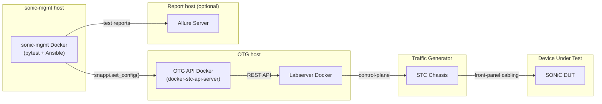

# # run_snappi_test.sh — Deployment and Test Automation Guide

## Overview

The `run_snappi_test.sh` script provides a one-command solution for deploying, configuring, validating, and testing a Snappi/OTG/STC-based SONiC lab environment.

Built on top of the workflow documented in the
[Snappi Environment Setup and Quick Test Guide](../README.md), it automates environment provisioning, testbed configuration generation, minigraph deployment, deployment and test parameters are managed through a single [`config.yaml`](config.yaml) file.

The solution supports deployment of sonic-mgmt, Labserver, the OTG API Service, the STC chassis, and an optional virtual SONiC DUT (`sonic-vs`).

It is **idempotent and reuse-aware**: re-running it does not blindly tear
down and rebuild everything. Already-healthy pieces (the sonic-mgmt
container, the sonic-mgmt checkout, the Labserver, the OTG service) are
detected and reused; only the containerlab topology is always destroyed and
redeployed, because that piece is fully tool-owned and cheap to recreate.

---

## Contents

- [1. Architecture](#1-architecture)
- [2. Prerequisites](#2-prerequisites)
- [3. Quick Start](#3-quick-start)
- [4. Directory Layout](#4-directory-layout)
- [5. Command-Line Usage](#5-command-line-usage)
- [6. config.yaml Reference](#6-configyaml-reference)
- [7. What Each Phase Does](#7-what-each-phase-does)
- [8. Reuse & Idempotency Behavior](#8-reuse--idempotency-behavior)
- [9. Failure Handling & `cleanup.env_on_failure`](#9-failure-handling--cleanupenv_on_failure)
- [10. `--destroy` and Ownership Tracking](#10---destroy-and-ownership-tracking)
- [11. Logs and Reports](#11-logs-and-reports)
- [12. Troubleshooting](#12-troubleshooting)
- [13. Command Cheat-Sheet](#13-command-cheat-sheet)

---

## 1. Architecture



| Component | Role |
|---|---|
| **sonic-mgmt Docker** | Runs Ansible playbooks and the `pytest` test suite. Talks to the DUT over SSH and to the traffic generator through the `snappi` SDK. |
| **OTG API Docker** (`docker-stc-api-server`) | Translates `snappi` API calls into STC/Labserver REST calls. |
| **Labserver** | Manages STC chassis port reservation/resource allocation. |
| **STC Chassis** | The traffic generator, deployed as a containerlab node. Its front-panel ports are wired either to a virtual DUT (`sonic-vs`, also a containerlab node) or cabled to a physical DUT. |
| **Allure Server** *(optional)* | Collects and renders HTML test reports. |

Everything above can be stood up on a single Linux host, including a single
WSL2 instance on Windows — this script detects WSL and applies the one extra
step it needs (`mount --make-rshared /`) automatically. Steps like this may
prompt for your sudo password — see [§2](#2-prerequisites) ("Sudo Password
Prompts") for details.

The OTG API Docker and Labserver can be deployed either as two independent
containers (`deployment.mode: standalone`) or together as one Docker Compose
stack (`deployment.mode: docker-compose`) — see [§6](#6-configyaml-reference)
and [§7.6](#7-what-each-phase-does). Either way, the relationship shown above
(OTG talks to Labserver over REST) is the same.

---

## 2. Prerequisites

**Host:** a Linux machine (or WSL2 instance) with `sudo`/root access and
outbound network reachability to GitHub and your package mirrors.

**Important: Run Docker Without `sudo`**

Membership in the `docker` group is required before running the automation.

While some script-managed Docker CLI operations can be executed with elevated privileges, not all Docker interactions can be intercepted or wrapped by the script. In particular:

- The sonic-vs image build process invokes `docker` commands from within the upstream `vrnetlab` Makefiles. These commands execute in separate shell processes and do not inherit the script's Docker wrapper logic.
- `containerlab` communicates directly with the Docker Engine through the Docker API/socket rather than invoking the Docker CLI, so it cannot be transparently redirected through `sudo docker`.

As a result, users without access to the Docker daemon (typically provided through membership in the `docker` group) may encounter permission errors during image build, deployment, or test execution.

To avoid these issues, add your user account to the `docker` group:

```bash
sudo usermod -aG docker $USER
```

Then log out and log back in, run `newgrp docker`, or restart the WSL
session (`wsl --shutdown`) for the change to take effect. Afterward, Docker
commands can be executed directly without `sudo`.

**Sudo Password Prompts**

On Ubuntu 24.04 (including WSL), certain setup operations require elevated
privileges and may prompt for a sudo password during environment
preparation. This is expected behavior and may occur when the script
performs system-level configuration steps (for example, mount propagation
configuration required by containerlab).

Users should ensure their account has sudo privileges before running the
automation.

If a fully unattended execution is required, advanced users may optionally
configure passwordless sudo (`NOPASSWD`) for the specific commands required
by their environment, subject to their organization's security policies.

**Software:** none of it needs to be pre-installed — phase 1
(`phase_env_check`) installs whatever is missing: `git`, `sshpass`, `curl`,
`jq`, `make`, Docker, Docker Compose, and [containerlab](https://containerlab.dev/),
plus `python3` + `PyYAML`. Pass `--skip-env-check` to skip this phase if your
host is already provisioned.

**Licensed VIAVI artifacts** — these are **not** public and are not part of
the `sonic-mgmt` repository. Contact VIAVI support to obtain them, then drop
them into `images.dir` (default `./images`, next to `config.yaml`):

| Artifact | Filename pattern | Version source |
|---|---|---|
| TestCenter (STC) chassis Docker image | `stc_<version>.tgz`, or a zip distribution `Spirent_TestCenter_Docker_<version>.zip` containing that same tgz (auto-extracted on first use) | `testcenter.version`, verbatim |
| Labserver Docker image | `labserver-<version>.tar.xz` | derived from `testcenter.version`, exact match |
| OTG API service installer | `otgservice.<major.minor>.*.sh` | derived from `testcenter.version`, **major.minor prefix only** |

The Labserver image and OTG service installer above are required for
**both** `deployment.mode: standalone` and `deployment.mode: docker-compose`
— the difference between the two is only *how* they're deployed, not which
artifacts are needed (see [§7.6](#7-what-each-phase-does)).

**`deployment.mode: docker-compose` only** — this mode uses the
[`testcenter-otg-setup`](https://github.com/Viavi-TestCenter/testcenter-otg-setup)
checkout this container solution itself ships inside (one directory above
`container/`) directly — no separate clone, and no manual prerequisite or
network access needed for it.

`testcenter.version` is the only version you set — Labserver and the OTG
service are no longer configured separately. Labserver expects an exact
match (`testcenter.version: "5.62.0766"` → `labserver-5.62.0766.tar.xz`),
since VIAVI ships it lockstep with STC. The OTG service installer is
versioned independently (its own patch/build numbering, e.g.
`otgservice.5.62.0009-20260112080331.sh`), but is still qualified per STC
release, so only the leading `major.minor` (`"5.62"` out of `"5.62.0766"`)
is required to match — glob-searched as `otgservice.5.62.*.sh`, erroring if
that matches zero or more than one file under `images.dir`. Confirm the
exact artifacts with VIAVI support for your lab; a mismatched combination is
a common source of control-plane connection failures. Each of these is
checked in the same order before the artifact file is ever required:
already running (or, for the Labserver, already loaded into `docker
images`) → nothing to do; only if neither is true does the script fall back
to the artifact file (see [§7.2](#7-what-each-phase-does)).

The STC chassis container is always rebuilt on the configured
`testcenter.version` (see §8), so it can never silently drift. The Labserver
is not: it's reused as-is whenever a running/responding container is already
there, without checking whether it matches the version derived from
`testcenter.version`. If it doesn't match, the script logs a warning naming
the running image and the configured version, then continues with the
mismatched Labserver rather than recreating it — recreating in place risks
dropping live sessions/state on it. To force the Labserver onto the
configured version, remove it yourself first (`docker rm -f labserver`, or
`--destroy` if it's tool-owned) before re-running — or bump
`testcenter.version` itself, which [§7.0](#7-what-each-phase-does)'s
version-change check will do for you automatically by default.

**Virtual DUT:** if `dut.mode: virtual`, either have the
`sonic-vs` image already tagged in `docker images`, or place a
`sonic-vs-*.tar.gz`/`.gz` archive under `images.dir` (or set
`dut.image_archive` explicitly). An image already in `docker images` is
always used as-is - even a custom/manually-built tag with no corresponding
SONiC branch name. If none of those apply and `dut.image`'s repository is
`vrnetlab/sonic_sonic-vs` (any tag - `master` or a release branch like
`202511`), the script downloads and builds it for you automatically (guide
§3.3) unless `dut.build_sonic_vs` is set to `false` - see §6 below.
`dut.download_source` (default `auto`) controls where the download comes
from: Azure Pipelines, sonic.software, or Azure with a sonic.software
fallback. Skip this entirely for `dut.mode: physical`.

**sonic-mgmt source:** leave `sonic_mgmt.source_dir` empty to let the script
clone and manage its own checkout, or point it at an existing checkout (e.g.
one you already use for other test work) to reuse as-is — see
[§7.3](#7-what-each-phase-does) for exactly how each mode behaves.

---

## 3. Quick Start

```bash
cd workspace/release

# 1. Place VIAVI artifacts (see §2) under ./images/, or point images.dir
#    at wherever you keep them.

# 2. Edit config.yaml for your lab: DUT IP/credentials/hwsku, cabled
#    links, image versions, deployment.mode, dut.mode. See §6.

# 3. Run it.
./run_snappi_test.sh

# Or, against a config file living elsewhere:
./run_snappi_test.sh -c /path/to/my-lab-config.yaml

# Preview the resolved configuration without deploying or testing anything:
./run_snappi_test.sh --show-config
```

Every run opens with a `SNAPPI TEST CONFIGURATION` block (versions,
deployment topology, sonic-mgmt source, cleanup policy) and, for a full run,
ends with a `SNAPPI TEST SUMMARY` block and `RESULT: PASS` (or `FAIL`) — see
[§11](#11-logs-and-reports) for what else is written to disk.

---

## 4. Directory Layout

```
workspace/release/
├── run_snappi_test.sh              # entry point
├── config.yaml                     # single source of truth for a lab run
├── snappi-stc-patch-v0.1.patch     # STC/OTG compatibility patch for sonic-mgmt
├── lib/                            # one file per phase, sourced by run_snappi_test.sh
│   ├── common.sh                   # logging, locking, ownership-state helpers
│   ├── config.sh                   # config.yaml loader/validator
│   ├── env_check.sh                # phase 1-2: host deps + artifact validation
│   ├── sonic_mgmt.sh                # phase 3: sonic-mgmt checkout + container
│   ├── gen_config.sh               # phase 4: Ansible/testbed/topology generation
│   ├── deploy.sh                   # phase 5: labserver/OTG/containerlab + --destroy
│   ├── verify.sh                   # phase 6: connectivity + inventory verify
│   ├── run_tests.sh                # phase 7: deploy-mg, pretest, smoke test
│   ├── cleanup.sh                  # phase 8: cache cleanup / failure teardown
│   └── report.sh                   # phase 9: summary + summary.json
├── images/                         # your local cache of VIAVI + sonic-vs artifacts
├── logs/<timestamp>/               # per-run logs (see §11)
└── .run_snappi_test/               # tool-owned work dir (see below)
    ├── state.env                   # OWN_* flags (what --destroy is allowed to remove)
    │                               #   + DEPLOY_MG_DONE (see §5)
    ├── run.lock                    # prevents two concurrent runs on the same config
    ├── snappi-topology.yml         # generated containerlab topology
    ├── otgservice/                 # extracted OTG service installer (standalone mode)
    ├── testcenter-otg-setup/        # docker-compose mode only: otg-compose.yaml/
    │                               #   Dockerfile/entrypoint.sh copied from the
    │                               #   testcenter-otg-setup checkout one directory
    │                               #   above container/, plus the generated .env
    │                               #   and image-pin override (see §7.6)
    └── sonic-mgmt/                 # default sonic-mgmt clone (if source_dir is empty)
```

`.run_snappi_test/` is entirely disposable — it's regenerated on the next
run — *except* that if you let the tool own the sonic-mgmt clone (empty
`sonic_mgmt.source_dir`), deleting it also deletes that checkout. Prefer
`--destroy` over `rm -rf` so teardown stays scoped to tool-owned resources.
Set `sonic_mgmt.keep_sonic_mgmt_src: true` if you want `--destroy` itself to
leave that clone in place too.

---

## 5. Command-Line Usage

```
./run_snappi_test.sh [-c config.yaml] [options]
```

| Option | Effect |
|---|---|
| `-c, --config <path>` | Path to `config.yaml` (default: `./config.yaml` next to the script). |
| `--skip-env-check` | Skip host dependency check/install (phase 1). |
| `--deploy-only` | Deploy the environment (sonic-mgmt + labserver + OTG + containerlab), then stop — no inventory verify, no deploy-mg, no pretest/smoke test/cleanup. |
| `--test-only` | Don't touch deployed infrastructure (no service deploy, no containerlab destroy/deploy). Runs lightweight health/connectivity/inventory validation against what's already running, then deploy-mg + pretest + smoke test. |
| `--deploy-mg` | Run only `deploy-mg` against an already-deployed environment (same preconditions as `--test-only`). Regenerates the Ansible config and runs connectivity/inventory verify first, then stops — no pretest/smoke test/cleanup. |
| `--pretest` | Run only the pretest against an already-deployed environment. If `deploy-mg` hasn't been done since the environment was last (re)deployed, it's triggered automatically first (same as `--deploy-mg`); otherwise the prior `deploy-mg` is reused. |
| `--smoke-test` | Run only the Snappi smoke test against an already-deployed environment. Same automatic `deploy-mg` trigger as `--pretest`. |
| `--no-cleanup` | Skip the post-test pytest/Ansible cache cleanup only. Never affects deployed services (see `--destroy` for that). |
| `--destroy` | Remove only resources this tool itself created. Never touches externally provisioned services, a user-supplied sonic-mgmt checkout, or a physical DUT. Runs no tests. |
| `--show-config` | Load, validate and print the resolved run configuration (versions, deployment topology, sonic-mgmt source, cleanup policy), then exit. Read-only — no lock, no log dir, no phases run. |
| `-h, --help` | Show usage and exit. |

**Mode → phases matrix:**

| Phase | full (default) | `--deploy-only` | `--test-only` | `--deploy-mg` | `--pretest` | `--smoke-test` | `--destroy` | `--show-config` |
|---|:---:|:---:|:---:|:---:|:---:|:---:|:---:|:---:|
| Env check / artifact validation | ✅ | ✅ | – | – | – | – | – | – |
| sonic-mgmt source + container | ✅ | ✅ | – (must already exist) | – (must already exist) | – (must already exist) | – (must already exist) | – | – |
| Ansible/testbed config generation | ✅ | ✅ | ✅ | ✅ | ✅ | ✅ | – | – |
| Labserver / OTG / containerlab deploy | ✅ | ✅ | – | – | – | – | – | – |
| Connectivity/inventory verify | ✅ | – | ✅ | ✅ | only if deploy-mg runs | only if deploy-mg runs | – | – |
| deploy-mg | ✅ | – | ✅ | ✅ | only if not already done | only if not already done | – | – |
| Pretest | ✅ | – | ✅ | – | ✅ | – | – | – |
| Snappi smoke test | ✅ (if pretest passed) | – | ✅ (if pretest passed) | – | – | ✅ | – | – |
| Cache cleanup | ✅ | – | ✅ | – | ✅ | ✅ | – | – |
| Teardown tool-owned resources | – | – | – | – | – | – | ✅ | – |

`--test-only`, `--deploy-mg`, `--pretest`, and `--smoke-test` all require the
environment to already be deployed — each fails fast with a clear error if
the sonic-mgmt container isn't running or the source checkout isn't present,
rather than silently deploying anything.

`--pretest` and `--smoke-test` skip `deploy-mg` (and the verify step that
precedes it) when a prior `deploy-mg` is already recorded as done for the
currently deployed environment — tracked as `DEPLOY_MG_DONE` in
`.run_snappi_test/state.env`. That flag is cleared whenever the environment
is redeployed (a `full`/`--deploy-only` run always recreates the containerlab
DUT node) or torn down (`--destroy`), and set whenever `deploy-mg` next
succeeds — via `full`, `--test-only`, `--deploy-mg`, or automatically via
`--pretest`/`--smoke-test`. Use `--deploy-mg` explicitly to force a rerun
without also running pretest/smoke test.

---

## 6. config.yaml Reference

All relative paths in `config.yaml` resolve against the directory containing
the config file itself, not the current working directory.

### `images`
| Field | Meaning |
|---|---|
| `dir` | Local cache directory for VIAVI + `sonic-vs` artifacts (§2). |

### `testcenter`
| Field | Meaning |
|---|---|
| `version` | STC chassis image version → expects `stc_<version>.tgz`, or `Spirent_TestCenter_Docker_<version>.zip` containing it. Also drives the Labserver and OTG service versions below — there is no separate field for either. |
| `license_server` | Written into the Labserver as `SPIRENTD_LICENSE_FILE`. |

Labserver and OTG service versions are **derived**, not configured directly
(see [§2](#2-prerequisites)): Labserver reuses `version` verbatim and
expects `labserver-<version>.tar.xz` exactly; the OTG service installer only
needs to match `version`'s leading `major.minor` and is glob-matched as
`otgservice.<major.minor>.*.sh`.

### `deployment`
| Field | Meaning |
|---|---|
| `mode` | `standalone` — this tool deploys Labserver/OTG itself (`docker run` + `otgctl`). `docker-compose` — this tool deploys Labserver **and** OTG together as one stack via VIAVI's `testcenter-otg-setup` Docker Compose repo (guide §3.5's "Docker Compose" flow), sourced from the checkout this container solution itself ships inside (one directory above `container/`) — no clone, no network access needed for it. `provisioned` — they already exist elsewhere; this tool only verifies reachability and never deploys or destroys them. |
| `docker_compose.keep_build_image` | Only used when `mode: docker-compose`. Optional, default `true`. `--destroy` (and same-scope teardowns) leave the OTG image built for this stack (`otg:latest`) in place, so the next deploy skips rebuilding it from the installer. Set `false` to also remove it on destroy. Never affects Labserver images — see [§8](#8-reuse--idempotency-behavior). |
| `labserver.ip` | Reachable IP of the Labserver. |
| `otg_service.ip` / `.port` | Reachable IP/port of the OTG API service. |
| `stc_chassis.ip` | STC chassis container's management IP (containerlab-assigned). |

The STC chassis (`stc_chassis.ip`) is **always** deployed via containerlab
regardless of `deployment.mode` — the mode only governs how the Labserver
and OTG service are deployed.

### `dut`
| Field | Meaning |
|---|---|
| `mode` | `virtual` (deploy `sonic-vs` via containerlab) or `physical` (existing hardware). |
| `hostname`, `mgmt_ip`, `hwsku`, `iface_speed` | DUT identity, matched against the Ansible inventory/topology. |
| `total_ports` | Full front-panel port count of the platform (topology port range) — independent of how many ports are actually cabled. |
| `image`, `image_archive` | Virtual mode only: the `sonic-vs` image tag, and optionally an explicit archive path (empty = auto-detect under `images.dir`). |
| `build_sonic_vs` | (optional, default `true`) Virtual mode only. If `image` is not found in `docker images` and no archive is found/configured, and `image`'s repository is exactly `vrnetlab/sonic_sonic-vs`, automatically build it (guide §3.3: download `sonic-vs.img.gz` for `image`'s tag per `download_source` below and run vrnetlab's build). Always builds the tag `image` actually asks for (`master` or a release branch like `202511`) - never fabricates one tag's content from another's build. Fails with a clear error if the selected source(s) have no published `sonic-vs.img.gz` for that tag - set to `false` to always require a manually provided image/archive. **An image already present in `docker images` is always used as-is** - including a custom/manually-built tag with no corresponding SONiC branch name - so none of this (or `download_source` below) is ever consulted for it. |
| `download_source` | (optional, default `auto`) Virtual mode only; only consulted when `build_sonic_vs` above actually needs to download+build (never for an already-local image). `auto` - try Azure Pipelines first, fall back to sonic.software if Azure has no successful build for that tag (or is unreachable). `azure` - Azure Pipelines only (`sonic-build.azurewebsites.net`, pipeline 142). `sonic.software` - sonic.software only. See guide §3.3. |
| `credentials.user` / `.password` | DUT login used for SSH key bootstrap and Ansible. |
| `links[]` | One entry per DUT↔STC cable: `dut_port`, `stc_port`, `bandwidth`, `vlan_id`, and (physical mode only) `host_interface` — the host NIC cabled to that STC port. **At least 2 links are required** for the all-to-all smoke test. |

### `otg`
| Field | Meaning |
|---|---|
| `credentials.user` / `.password` | Account the test framework uses to reach the OTG API server. |
| `rest_port` | OTG API port (also written into `snappi_api_server` in group_vars). |
| `ssh_user` | Optional `ansible_user` for the `[ptf]` inventory line; leave empty to omit. |

### `sonic_mgmt`
| Field | Meaning |
|---|---|
| `source_dir` | Empty ⇒ clone fresh under `.run_snappi_test/sonic-mgmt`. Set to an existing checkout to reuse it **as-is** (see [§7.3](#7-what-each-phase-does)). |
| `repo`, `branch` | Clone source, tool-owned checkouts only. |
| `baseline_commit` | The exact commit the STC/OTG patch is validated against. |
| `patch.apply` | Explicit toggle for applying the compatibility patch. Never applied automatically to a dirty existing checkout either way. |
| `patch.file` | Path to the patch file. |
| `keep_sonic_mgmt_src` | Optional, default `false`. If `true`, `--destroy` (and the same-scope teardowns from `cleanup.env_on_failure`/`replace_on_version_change`) will **not** delete a tool-owned sonic-mgmt clone (`source_dir` empty) — every other tool-owned resource is still removed. Has no effect on a user-supplied checkout (`source_dir` set), which this tool never deletes regardless. See [§10](#10---destroy-and-ownership-tracking). |

### `cleanup`
| Field | Meaning |
|---|---|
| `env_on_failure` | After deploy-mg or pretest/smoke test **fails**, automatically tear down tool-owned environment resources (same scope as `--destroy`). A successful run always leaves the environment deployed for reuse, regardless of this setting. Doesn't apply to `--deploy-only`, which always keeps the environment. |
| `replace_on_version_change` | Optional, default `true`. If a tool-owned STC chassis container from a previous run is still deployed on a different `testcenter.version` than this run's config, automatically tear down the whole tool-owned environment (same scope as `--destroy`) before deploying fresh on the new version. Set `false` to keep the old environment instead and fall back to each resource's normal reuse check — this can leave components on mixed versions. See [§7.0](#7-what-each-phase-does) and [§8](#8-reuse--idempotency-behavior). |

### `logging`
| Field | Meaning |
|---|---|
| `dir` | Empty ⇒ `logs/` under the current working directory (where the script is invoked from). |

### `allure`
| Field | Meaning |
|---|---|
| `enabled` | Opt-in only — nothing Allure-related is deployed or used unless `true`. |
| `host` | Empty ⇒ this host's own address. |
| `ui_port`, `api_port`, `project_id` | Allure Docker service ports and project id. |

### `testbed`
| Field | Meaning |
|---|---|
| `conf_name` | The **testbed name** used on every `pytest`/`testbed-cli.sh` invocation. |
| `inv_name` | Ansible inventory filename. |
| `dut_group_name`, `server_group` | Inventory group names for the DUT and the STC-hosting server. |

### `topology`
| Field | Meaning |
|---|---|
| `name` | Topology name — generates `vars/topo_<name>.yml`. Keep this an **exact** name (not just containing `ptf32`) — see the patch note in [§7.3](#7-what-each-phase-does). |
| `dut_type` | Device role for minigraph generation; `ToRRouter` gives front-panel ports the VLAN/L3 addressing a Snappi test port needs. |
| `vlan.id/prefix/prefix_v6/tag/mac` | The VLAN that owns the host-facing test ports and the subnet minigraph generation assigns test IPs from. |

---

## 7. What Each Phase Does

### 7.0 Version change check (`lib/deploy.sh::phase_check_version_change`)
Runs first, before 7.1, for `full`/`deploy-only` only. If a tool-owned STC
chassis container from a previous run is still around, its actual deployed
version is read straight off the running container (`docker inspect` on the
`...-snappi-sonic-stc` node's image tag) and compared against this run's
`testcenter.version`. On a mismatch it prints:

```
Detected existing deployment:
Version: 5.62.0766

Existing environment will be destroyed and replaced by 5.65.2556.
```

and then, governed by `cleanup.replace_on_version_change` (default `true`),
either tears down the whole tool-owned environment (`phase_destroy` — same
scope as `--destroy`) so every phase below deploys fresh on the new version,
or (if set `false`) just warns and leaves it to each resource's own reuse
check in [§7.6](#7-what-each-phase-does) — which can leave components on
mixed versions, since only the containerlab STC node is unconditionally
rebuilt every run regardless of version. No tool-owned deployment yet (first
run, or nothing tracked in `.run_snappi_test/state.env`) → silently skipped.

### 7.1 Environment prep (`lib/env_check.sh::phase_env_check`)
Installs whatever's missing among `git`, `sshpass`, `curl`, `jq`, `make`,
Docker, Docker Compose, containerlab, and `python3`+`PyYAML`. Every check is
idempotent — nothing already meeting the minimum requirement is reinstalled.
Skippable with `--skip-env-check`.

### 7.2 Artifact validation (`lib/env_check.sh::phase_check_artifacts`)
For each VIAVI artifact (STC, Labserver, OTG service) and the `sonic-vs`
image, checks — in order — whether it's already usable (image already in
`docker images`, container/labserver already exists, OTG port already
reachable) before requiring a matching file under `images.dir`. Matching is
exact-filename-first; a glob fallback exists purely to produce a clear
zero-match/ambiguous-match error, never to silently substitute a "close
enough" file. For `sonic-vs` specifically, an image already present in `docker images` is
always used as-is — even a custom/manually-built tag with no corresponding
SONiC branch name — and none of the branch/tag lookup below ever runs for
it. Only if nothing above applies and `dut.image`'s repository is
`vrnetlab/sonic_sonic-vs` (any tag), `dut.build_sonic_vs` (default `true`)
triggers an automatic build here instead of failing — downloading
`sonic-vs.img.gz` for that tag per `dut.download_source` (default `auto`:
Azure Pipelines, falling back to sonic.software) and running vrnetlab's
build (guide §3.3); it always builds the exact tag configured, failing
clearly if the selected source(s) have no published build for it.

### 7.3 sonic-mgmt source (`lib/sonic_mgmt.sh::phase_sonic_mgmt_source`)
- **User-supplied checkout** (`sonic_mgmt.source_dir` set): never checked
  out or reset by this tool. If the tree is dirty, it's left completely
  untouched (no checkout, no patch). If clean and `patch.apply: true`, the
  STC/OTG patch is applied if not already present.
- **Tool-owned checkout** (`source_dir` empty): if already on the exact
  `baseline_commit`, the checkout is reused as-is — its working tree is
  expected to be permanently dirty after the first patch + config
  generation, and that's by design, not an error. If it's on a different
  commit, the tool checks locally whether that commit is already present
  (no network needed in the common case, since it was reachable from the
  branch tip at clone time) — only fetching the configured branch, and only
  when the commit truly isn't there yet. If the tree is dirty *and* on the
  wrong commit, the run stops rather than risk discarding real changes.
- **Patch application** is idempotent: it first checks whether the patch
  reverse-applies cleanly (meaning it's already in place) before attempting
  a forward apply.

### 7.4 sonic-mgmt container (`lib/sonic_mgmt.sh::phase_sonic_mgmt_container`)
If a container named `snappi-sonic-mgmt` is already running with the source
directory correctly bind-mounted, it's reused — no redeploy — and a log line
names both the container and the image it's actually running, warning (but
not failing) if that image differs from the configured
`docker-sonic-mgmt:latest`. A stopped container is restarted and reused the
same way. Only when no usable container exists (or the mount is missing) is
the image pulled/loaded and `setup-container.sh` run to create a fresh one.

### 7.5 Ansible/testbed config generation (`lib/gen_config.sh`)
Regenerates the device/link CSVs, Ansible inventory, `topo_<name>.yml`, the
Ansible Vault password placeholder, and the containerlab topology file
entirely from `config.yaml` — every run, so they never drift from it.
`testbed.yaml` and the `group_vars/<inv_name>/<inv_name>.yml` file are
**patched in place** rather than overwritten, so unrelated content in those
shared sonic-mgmt files survives.

### 7.6 Lab services deployment (`lib/deploy.sh::phase_deploy_services`)
- **Labserver** (`standalone`/`provisioned` modes): `provisioned` mode only
  verifies reachability and never deploys/destroys it. `standalone` mode
  reuses an already-running, responding container; restarts and reuses a
  stopped one; only creates a new one if neither works, then configures the
  license and fixes a stcweb/nginx port conflict if the default port is
  occupied.
- **OTG service** (`standalone`/`provisioned` modes): `provisioned` mode
  only verifies reachability. `standalone` mode reuses it if already
  listening on the configured port; otherwise runs the installer and starts
  it.
- **Labserver + OTG service together** (`docker-compose` mode): deploys both
  as one Docker Compose stack instead of the two steps above. Sequence:
  1. **Conflict check** — if a container literally named `labserver` or
     `otg` already exists but wasn't created by this tool's own Compose
     project (e.g. left over from `standalone` mode, or started manually),
     the run stops with a message naming the exact container to remove
     first, rather than letting `docker compose up` fail on a generic
     "name already in use" error.
  2. **Reuse check** — scoped to containers actually labeled with this
     tool's Compose project (`com.docker.compose.project=snappi-otg-compose`),
     not by name alone, plus Labserver HTTP + OTG TCP reachability. A
     version mismatch on a reused Labserver image is warned about (same
     policy as `standalone` mode) but doesn't block reuse.
  3. If not reusable: validates the `testcenter-otg-setup` checkout this
     container solution ships inside (see §2) still has the expected
     `otg-compose.yaml`/`Dockerfile`/`entrypoint.sh` layout, copies those
     files into `.run_snappi_test/testcenter-otg-setup/` together with the resolved
     OTG installer, and ensures the Labserver image is present under **both**
     `registry.oriontest.net/labserver:<testcenter.version>` (the versioned
     tag this stack runs, matched by the generated override file — not
     `:latest`, so multiple STC releases' images can coexist on the host)
     and the bare `labserver:<testcenter.version>` tag `standalone` mode
     uses. Whichever of the two (or any other tag matching the version)
     already exists becomes the source for a cheap `docker tag` onto the
     other — the artifact `.tar.xz` is only loaded if neither exists yet.
     Then writes a real `.env` (`LICENSE_SERVER`, `LABSERVER`, `otg_build`)
     and runs
     `docker compose -p snappi-otg-compose -f otg-compose.yaml -f snappi-labserver-image.override.yaml up -d --build`.
  4. Waits for Labserver HTTP + OTG TCP reachability, then records the
     stack as tool-owned (`OWN_COMPOSE`, see [§10](#10---destroy-and-ownership-tracking)).
- **containerlab (STC [+ virtual DUT])**: always destroyed and redeployed —
  this is the one piece that's always fully tool-owned and cheap to
  recreate, so there's no reuse-detection here. Node containers are
  double-checked against `docker ps` after `containerlab deploy`, since that
  command can exit 0 while a node still fails to start.
- **DUT SSH key bootstrap**: installs the sonic-mgmt container's SSH pubkey
  onto the DUT (containerlab destroy/deploy wipes `authorized_keys` on every
  virtual redeploy, so this always re-runs after it).
- **Allure** *(optional)*: reused if already running; otherwise deployed via
  Docker Compose, only when `allure.enabled: true`.

### 7.7 Connectivity/inventory verify (`lib/verify.sh::phase_verify`)
Checks DUT SSH (22), STC (80), Labserver (HTTP), and OTG service (TCP)
reachability, confirms sonic-mgmt→DUT SSH key auth works, then runs
`ansible-inventory --graph` and checks the expected `@<server_group>`,
DUT host, and `@ptf` entries are present. Runs after a full deploy, and
standalone (non-destructively) under `--test-only`.

### 7.8 deploy-mg, pretest, smoke test (`lib/run_tests.sh`)
Runs, inside the sonic-mgmt container:
1. `testbed-cli.sh ... deploy-mg` — generates and pushes the minigraph
   (VLAN/IP config) to the DUT.
2. `pytest test_pretest.py` — health/reachability/port-discovery checks.
3. `pytest snappi_tests/test_snappi.py` — the all-to-all bidirectional
   traffic smoke test (ARP resolution + Tx/Rx within tolerance on every
   flow).

Each step's full output is captured under `$LOG_DIR`; a short summary line
is extracted for the console report. Allure flags are added automatically
to the `pytest` command line when `allure.enabled: true` — otherwise no
report is generated for that run.

`--deploy-mg`, `--pretest`, and `--smoke-test` let you run one of these
steps in isolation against an already-deployed environment instead of the
full `deploy-mg` → pretest → smoke test sequence — see [§5](#5-command-line-usage)
for the `DEPLOY_MG_DONE` auto-trigger behavior of `--pretest`/`--smoke-test`.

### 7.9 Cache cleanup + report (`lib/cleanup.sh`, `lib/report.sh`)
Clears the pytest fact cache (`tests/_cache`, `.pytest_cache`) inside the
sonic-mgmt container unless `--no-cleanup` was passed or the environment was
just torn down after a failure. This is unrelated to environment teardown —
it never touches any deployed container or topology. Finally, prints a
phase-by-phase `SNAPPI TEST SUMMARY` and writes a machine-readable
`summary.json` next to the run's logs.

---

## 8. Reuse & Idempotency Behavior

Summary of what gets reused vs. always rebuilt on a re-run **once past the
[§7.0](#7-what-each-phase-does) version-change check** — i.e. this table
describes normal re-runs on an unchanged `testcenter.version`, or a changed
one with `cleanup.replace_on_version_change: false`. On a version bump with
the (default) `true` setting, none of this applies: the whole tool-owned
environment is destroyed up front and every row below deploys fresh.

| Resource | Behavior on re-run |
|---|---|
| Host packages (Docker, containerlab, etc.) | Reused — never reinstalled if already meeting the minimum requirement. |
| sonic-mgmt checkout | Reused if already on the baseline commit (tool-owned) or always left alone (user-supplied). |
| sonic-mgmt container | Reused if running and correctly mounted; restarted if stopped; only recreated otherwise. |
| Labserver (`standalone`/`provisioned`) | Reused if running and responding; restarted if stopped; otherwise recreated from an already-loaded docker image if one is present, and only from the artifact file as a last resort. Reuse is never blocked on version — if the running container's image doesn't match the version derived from `testcenter.version`, the script warns and continues with it anyway (see §2, and §7.0 for the one case that overrides this by tearing it down anyway). |
| OTG service (`standalone`/`provisioned`) | Reused if already reachable on the configured port. |
| Labserver + OTG stack (`docker-compose`) | Reused as one unit only if both containers are labeled with this tool's own Compose project and both are reachable (a mismatch is warned about but doesn't block reuse — same policy as standalone Labserver); recreated, with the OTG image rebuilt, otherwise from the `testcenter-otg-setup` checkout this container solution ships inside — see §2/§6. |
| containerlab topology (STC [+DUT]) | **Always** destroyed and redeployed. |
| DUT SSH key | Re-bootstrapped every run (cheap; also required after the containerlab redeploy above wipes it). |
| Allure | Reused if running; otherwise deployed only when enabled. |
| Ansible/testbed/topology files | Regenerated (or patched in place) every run from `config.yaml`, so they can't drift out of sync with it. |

---

## 9. Failure Handling & `cleanup.env_on_failure`

If `deploy-mg`, the pretest, or the smoke test fails, the run's exit code is
non-zero and `cleanup.env_on_failure` in `config.yaml` decides what happens
next:

- `false` (default): the environment is left deployed exactly as it was at
  the point of failure — useful for debugging in place.
- `true`: the tool-owned environment is automatically torn down, in the
  exact same scope as `--destroy`.

A **successful** run always leaves the environment deployed for reuse,
regardless of this setting. `--deploy-only` always keeps the environment
deployed regardless of outcome (there's no test phase to fail).

---

## 10. `--destroy` and Ownership Tracking

Every resource this tool creates is recorded in
`.run_snappi_test/state.env` (`OWN_CLAB`, `OWN_LABSERVER`, `OWN_OTG`,
`OWN_COMPOSE`, `OWN_ALLURE`, `OWN_SONIC_MGMT_CONTAINER`,
`OWN_SONIC_MGMT_CLONE`). `OWN_COMPOSE` covers the combined Labserver+OTG
stack under `deployment.mode: docker-compose` — `OWN_LABSERVER`/`OWN_OTG`
are only ever set by `standalone` mode instead. `--destroy` reads that file
and removes **only** the resources flagged there — it never touches:
- a `provisioned`-mode Labserver or OTG service,
- a user-supplied sonic-mgmt checkout (`sonic_mgmt.source_dir` set),
- a tool-owned sonic-mgmt clone when `sonic_mgmt.keep_sonic_mgmt_src: true` —
  every other tool-owned resource (containerlab topology, Labserver, OTG
  service, Allure, sonic-mgmt container) is still torn down as usual,
- or a physical DUT.

The `docker-compose`-mode stack (`OWN_COMPOSE`) is torn down via
`docker compose down` when `.run_snappi_test/testcenter-otg-setup/` is still
present; if that directory was removed out-of-band, it falls back to
removing containers by Compose project label
(`com.docker.compose.project=snappi-otg-compose`) rather than by the
(fairly generic) `labserver`/`otg` container names, so an unrelated
container sharing one of those names is never touched. `docker compose
down` never removes images by itself, so the built OTG image (`otg:latest`)
survives every teardown by default; with
`deployment.docker_compose.keep_build_image: false` it's explicitly removed
afterward too. Labserver images are never removed by `--destroy` regardless
of that setting — they're cached VIAVI artifacts, not build output, and may
still be needed by a `standalone`-mode deployment.

`--destroy` runs no tests and is safe to run even if nothing is currently
deployed (each resource type is skipped individually if not tool-owned).

---

## 11. Logs and Reports

Each run creates `logs/<YYYYMMDD_HHMMSS>/` (path controlled by
`logging.dir`) containing:

| File | Contents |
|---|---|
| `run.log` | Full timestamped log of every phase. |
| `deploy_mg.log` | Full `testbed-cli.sh deploy-mg` output. |
| `pretest.log` | Full pretest `pytest` output. |
| `smoke_test.log` | Full smoke-test `pytest` output. |
| `summary.json` | Machine-readable: overall result, config file used, log dir, Allure URL (if enabled), and a `phases[]` array of `{name, status, detail}`. |

If `allure.enabled: true`, the console summary and `summary.json` also carry
the Allure report URL for that run.

---

## 12. Troubleshooting

| Symptom | Likely cause | Action |
|---|---|---|
| `Another run_snappi_test.sh run is already holding the lock` | A previous run is still active (or crashed while holding the lock). | Wait for it to finish, or confirm nothing is running and remove `.run_snappi_test/run.lock`. |
| `Ambiguous artifact match for ... under $IMAGES_DIR` | Multiple files matched a version glob (e.g. two `stc_*.tgz`). | Pin the exact version in `config.yaml` so exactly one file matches, or remove the stale one. |
| `Patch does not apply cleanly` | The sonic-mgmt checkout has diverged from `sonic_mgmt.baseline_commit`. | Let the tool re-checkout the baseline commit (tool-owned checkouts do this automatically when clean), or update the patch for your commit. |
| `Tool-owned sonic-mgmt checkout ... has uncommitted changes - refusing to switch commits` | The checkout is both on the wrong commit and dirty. | Investigate/reset it manually, or delete the directory to let the tool re-clone. |
| `connect() failed` from the Snappi client during the smoke test | OTG API server IP/port unreachable. | Check `otg.rest_port`/`deployment.otg_service.ip` in `config.yaml` and the OTG container's network reachability. |
| Ports stuck "Reserved" | Labserver/STC chassis reservation conflict. | Release/re-reserve ports on the chassis, or restart the Labserver container. |
| `docker compose up failed: host port ... is already in use` (`deployment.mode: docker-compose`) | A previous labserver/OTG deployment (this tool's own, or a manual one) is still holding that host port — `_preflight_check_compose_conflicts` only catches a foreign container literally named `labserver`/`otg`; a stale container under some other name, or an unrelated process, isn't caught until `docker compose up` itself fails to bind. | Run `./run_snappi_test.sh --destroy` to remove any tool-owned resources, confirm nothing else is bound to the port named in the error (`ss -tlnp \| grep <port>`), then re-run. |
| `This test requires at least 2 ports` (skipped) | Fewer than 2 usable, IP-addressed test ports were found. | Confirm `dut.links[]` has at least 2 entries and `deploy-mg` ran after any topology change. |
| Test hangs waiting on ARP | Wrong VLAN subnet, or minigraph not redeployed after an edit. | Check `topology.vlan.prefix`, re-run (deploy-mg re-runs automatically on every full run). |
| Stale results / test won't pick up config changes | Cached pytest/Ansible facts. | Re-run without `--no-cleanup`, or delete `tests/_cache` and `.pytest_cache` inside the sonic-mgmt container. |
| WSL2: containerlab/Docker networking issues | `mount --make-rshared /` not yet applied. | Already handled automatically by phase 6 when WSL is detected — re-run if you hit this after manually restarting Docker. |
| `A container named 'labserver'/'otg' already exists but is not part of this tool's docker-compose stack` | `deployment.mode: docker-compose`, but a same-named container already exists from `standalone` mode or a manual run. | Remove it (`docker rm -f labserver`/`otg`), or `--destroy` under whichever mode created it, then re-run. |
| `otg-compose.yaml under ... does not define a 'labserver'/'otg' service` or `is missing expected file` | The `testcenter-otg-setup` checkout this container solution ships inside (one directory above `container/`) doesn't match the layout this integration expects (e.g. it's been edited or an upstream repo change altered it). | Restore that checkout to a known-good `testcenter-otg-setup` layout (matching guide §3.5). |
| `Deploying/verifying lab services` spinner runs for minutes with no progress | Not caused by the docker-compose stack anymore — it no longer does any network git operation. Check `deploy_services.log` for what's actually running (e.g. `docker compose ... --build` pulling a base image / installing packages can take a while on a slow link — this is normal progress, not a hang, just not reflected in the spinner text). |
| `permission denied while trying to connect to the docker API at unix:///var/run/docker.sock`, or an artifact/image reported missing that's clearly in `docker images` | This shell's `docker` group membership isn't active (common right after the user was added to the group without a fresh login) — `docker_bootstrap_sudo` (`lib/common.sh`) detects this and falls back to `sudo docker` for the rest of the run, priming it once up front so later calls don't silently hang waiting on a password. If it still blocks, `sudo` itself is failing (misconfigured `sudoers`, or a password is required and nobody is watching the terminal). | Enter the `sudo` password when prompted at the start of the run, or avoid the prompt entirely by fixing the underlying group membership — see [§2](#2-prerequisites). |

If clearing the cache doesn't resolve an issue, `--destroy` and re-run —
this discards only tool-owned state, never a physical DUT or externally
provisioned services.

---

## 13. Command Cheat-Sheet

```bash
# Full run (deploy, verify, deploy-mg, pretest, smoke test, cleanup, report)
./run_snappi_test.sh

# Against a specific config
./run_snappi_test.sh -c /path/to/config.yaml

# Bring the environment up and stop there
./run_snappi_test.sh --deploy-only

# Re-run just the tests against an already-deployed environment
./run_snappi_test.sh --test-only

# Run only deploy-mg against an already-deployed environment
./run_snappi_test.sh --deploy-mg

# Run only the pretest - triggers deploy-mg first automatically if it
# hasn't been done since the environment was last (re)deployed
./run_snappi_test.sh --pretest

# Run only the Snappi smoke test - same automatic deploy-mg trigger
./run_snappi_test.sh --smoke-test

# Full run, but keep the pytest/Ansible cache afterward for debugging
./run_snappi_test.sh --no-cleanup

# Skip host dependency installation (already-provisioned host)
./run_snappi_test.sh --skip-env-check

# Tear down everything this tool created (never touches externally
# provisioned services, a user-supplied checkout, or a physical DUT)
./run_snappi_test.sh --destroy

# Print the resolved run configuration and exit (no deploy, no test, no lock)
./run_snappi_test.sh --show-config
```
